# Pizza Hemma Restaurant Website


[View Live Website here](https://pizza-hemma-4a540b28342f.herokuapp.com/)

[GitHub Repo](https://github.com/Chatlada-Nina/pizza-hemma)

**Welcome to Pizza Hemma Restaurant!!**

**Pizza Hemma Restaurant** The purpose of the Pizza Hemma website is to provide an inviting and heartfelt space that reflects the cozy, home-like atmosphere of the pizzeria. It aims to share the story of Pizza Hemma’s cherished traditions, highlighting its use of high-quality ingredients and affordable, delicious pizzas crafted with love. The website serves as a bridge between the restaurant and customers by offering essential information such as the menu, prices, and contact details while also fostering a sense of community through customer testimonials and interactive features. For the owner, it is a tool to engage with the local community, build loyalty, and showcase the unique qualities that make Pizza Hemma a beloved dining destination.


## CONTENTS

- [UX - User Experience](#ux)

  - [Colours Theme](#colours-theme)
  - [Typography](#typography)
  - [Wireframes](#wireframes)
  - [Data Schema](#data-schema)
  - [User stories](#user-stories)
  - [Agile Development](#agile-development)
  - [Technologies Used](#technologies-used)

- [Features](#features)

  - [Navigation Bar](#navigation-bar)
  - [Home page](#home-page)
  - [About us page](#about-us-page)
  - [Menu page](#menu-page)
  - [Cart page](#cart-page)
  - [checkout page](#checkout-page)
  - [Reviews page](#review-page)
  - [Sign up page](#sign-up-page)
  - [Sign in page](#sign-in-page)
  - [Contact page](#contact-page)
  - [Profile page](#profile-page)
  - [The Footer](#the-footer)
  - [Custom Error Handler page](#custom-error-handler-page)
  - [Features left to implement](#features-left-to-implement)

- [Testing](#testing)

- [Deployment & Local deployment](#deployment-&-Local-deployment)

  - [Deployment](#deployment)
  - [Local Deployment](#local-deployment)

- [Credits](#credits)
  - [Content](#contents)
  - [Media](#media)
  - [Code](#code)

## UX

### User’s Goal

Users want to explore and connect with the restaurant in their local area which is in Gothenburg in this website,They want to learn about the story and values behind Pizza Hemma, browse the menu to find their favorite pizza, check prices, or gather practical information like location and opening hours. Some users aim to order online, make a contact, or even share their own experiences on the reviews page and get some exclusive offering.

### Owner’s Goal

The site owner aims to enhance the restaurant's visibility and attract more customers by showcasing its unique qualities, such as traditional recipes, affordable prices and love behind each pizza. The owner seeks to grow Pizza Hemma’s reputation as a beloved, home-like destination while fostering loyalty and trust among customers in the local area.

### Colours Theme

The Pizza Hemma is a local user-friendly restaurant website. The main colours I chose are Green and Red as they reflect the Italian flag. This creates an authentic and traditional feel, reinforcing the pizzeria's heritage. Green represents freshness, natural ingredients, and health. Red is known to stimulate appetite and create a sense of warmth, passion, and excitement, food-focused environment. It draws attention and makes the space feel vibrant and welcoming. Both colors highlights the use of high-quality, fresh ingredients in the pizzas. Moreover, I used [WebAIM:Contrast Checker](https://webaim.org/resources/contrastchecker/) to check the contrast of my colours to ensure they are easy to read for users.


### Typography

I used [Alfa Slab One](https://fonts.google.com/specimen/Alfa+Slab+One) pairing with [Chivo](https://fonts.google.com/specimen/Chivo) referred to [Creatopy-Google Font Pairings](https://www.creatopy.com/blog/google-font-pairings/) Chivo have details that make the text look remarkable but not steal the spotlight from Alfa Slan One which is designed for a title with great personality that is meant to be seen.

Additionally, I use [Font Awesome](https://fontawesome.com/) for icons to make the site casual and friendly and for my social media icons in the footer to help users quickly and easily identify my social media sites.

### Wireframes

[Homepage 1](/documentation/wireframe/homepage1.png)

[Homepage 2](/documentation/wireframe/homepage2.png)

[About page](/documentation/wireframe/about-page.png)

[Menu page](/documentation/wireframe/menu-page.png)

[Reviews page 1](/documentation/wireframe/reviews-page1.png)

[Reviews page 2](/documentation/wireframe/reviews-page2.png)

[Profile page 1](/documentation/wireframe/profile-page1.png)

[Profile page 2](/documentation/wireframe/profile-page2.png)

[Checkout page](/documentation/wireframe/checkout-page.png)

[Sign up page](/documentation/wireframe/signup-page.png)

[Sign in page](/documentation/wireframe/signin-page.png)

[Contact page](/documentation/wireframe/contact-page.png)

[Mobile Screen page 1](/documentation/wireframe/mobile-screen1.png)

[Mobile Screen page 2](/documentation/wireframe/mobile-screen2.png)

### Data Schema

I used [Lucidchart](https://www.lucidchart.com/pages) for my data plan. The data schema for the Pizza Hemma Restaurant website is structured using a relational model, as illustrated in the Entity Relationship Diagram (ERD) provided. Below is an Entity Relationship Diagram that shows the key models and their fields:

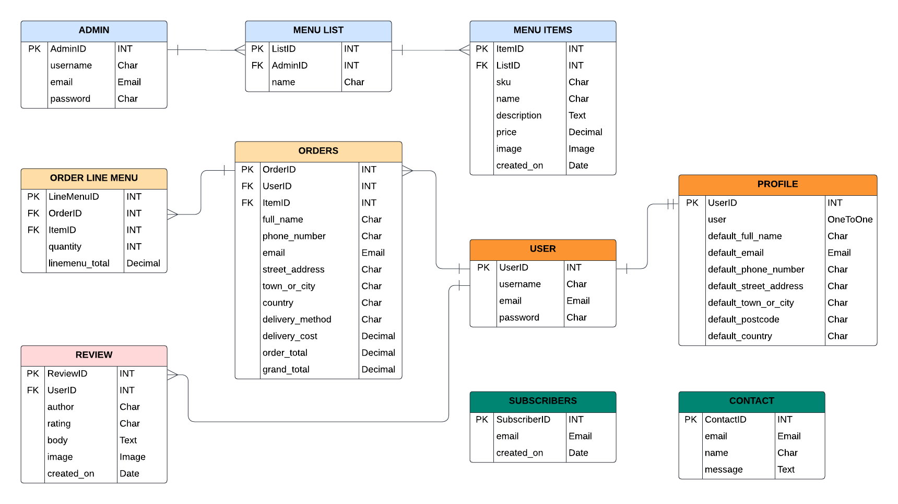

### User stories

1. As a new user, I can create an account so that I can save my personal details and preferences for a personalized experience.
2. As a user, I can log in and log out so that I can securely access my account and order history.
3. As a user, I can browse the menu so that I can see all the pizzas and other menus and their details.
4. As a user, I can see my order details and price so that I can make sure my order is correct before payment.
5. As a user, I can add pizzas to my cart or delete pizzas from my cart so that I can place a correct order for my favorite pizzas.
6. As a user, I can choose to place an order online so that I can get my pizza delivered or pick it up from the restaurant.
7. As a user, I can place an order online so that I can get my pizza delivered from the restaurant.
8. As a user, I can make secure payments easily so that I can pay for my order online through the website.
9. As a user, I can receive a receipt after a successful payment so that I have proof of my purchase.
10. As a user, I can update my profile information so that I can keep my contact details and preferences up to date.
11. As a user, I can view my order history so that I can reorder my favorite pizzas easily.
12. As a user, I can subscribe to special offers so that I can receive exclusive deals and promotions.
13. As an admin, I can add new pizzas and ingredients to the menu so that I can keep the menu up to date with new offerings.
14. As an admin, I can manage user accounts so that I can assist users with account-related issues and maintain security.
15. As an admin, I can view and manage orders so that I can ensure correctly orders, timely preparation and delivery of pizzas.
16. As an admin, I can view and manage payments so that I can keep track of all transactions and handle any payment issues.
17. As a user, I can leave feedback and reviews for pizzas so that I can share my dining experience and help others make informed choices.
18. As an admin, I can monitor and respond to user feedback so that I can address any issues and improve the restaurant's service.

User Stories and Acceptance Criteria help me ensure each feature meets the desired functionality and user experience.

### Agile Development

This project was designed using Agile methodology, utilising the Project Board and Issues sections on GitHub.

- [Project Board](https://github.com/users/Chatlada-Nina/projects/10/views/1)

## Technologies Used

### Languages

- HTML
- CSS
- Javascript
- Python

### Frameworks, programs and libraries

- [Django](https://docs.djangoproject.com/en/5.0/) - Framework used to create website.
- [AllAuth](https://docs.allauth.org/en/latest/) - used to provide authentication framework for the project.
- [Django signals](https://docs.djangoproject.com/en/5.0/topics/signals/) - Using signals.py to automatically create a profile when a new member registers.
- [PostGreSQL database](https://www.postgresql.org/) - used as the relational database management for the website.
- [Github](https://github.com/) - Used for hosting the repository.
- [VS Code](https://code.visualstudio.com/) - Used for developing the application.
- [Am I Responsive?](https://ui.dev/amiresponsive) - Used to create an image of the website on various screen sizes.
- [Heroku](https://www.heroku.com/) - Used for deploying the live project.
- [Bootstrap](https://getbootstrap.com/) - Used to add style to the displayed pages.
- [Microsoft Copilot](https://copilot.microsoft.com/) - Used to create the content on the pages.
- [Clouidnary](https://cloudinary.com/) - Used to host images and integrate with django and the admin portal.

## Features

### Navigation Bar

- The full responsive navigation bar includes the Pizza Hemma logo that link to the homepage, About, Menu, Review, Contact, Cart, Account icon dropdown to Register and Login page and the Call-To-Action button "ORDER HERE". The nevigation bar is identical on each page to allow users for easy navigation at all time.

- The pictures below show the Navigation bar on the laptop and mobile screen sizes.

Navigation bar on the laptop screen size:<br>
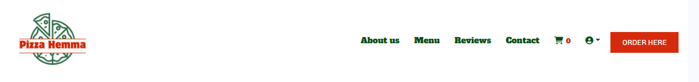

Navigation dropdown menu on mobile screen size:<br>
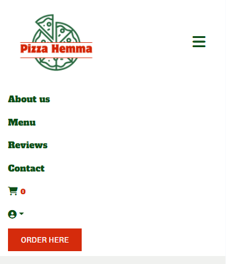

### Home Page

- The Home Page of the Pizza Hemma website is designed to be welcoming and appetite-stimulating. It features an engaging image that highlights the newest menu items and includes a clear "ORDER NOW" button, directing users straight to the menu page. Below this, the site presents a menu overview with categories such as Pizza, Appetizers, and Drinks, along with a "See Our Menu Here" link that guides users to their selected section of the menu page. For visitors who wish to stay connected but aren't ready to become members, a Subscribe section is available. By simply entering their email, they can receive exclusive offers. Additionally, a sticky navigation bar ensures seamless browsing by staying visible as users scroll, providing easy access to key areas of the site at all times.

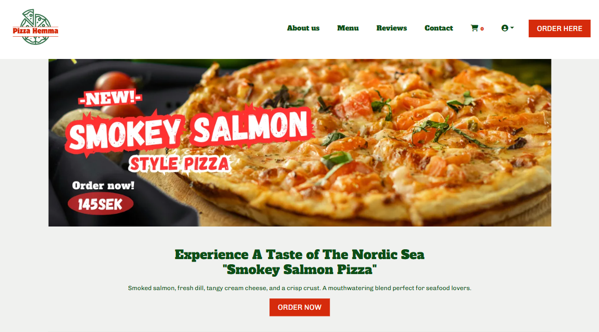

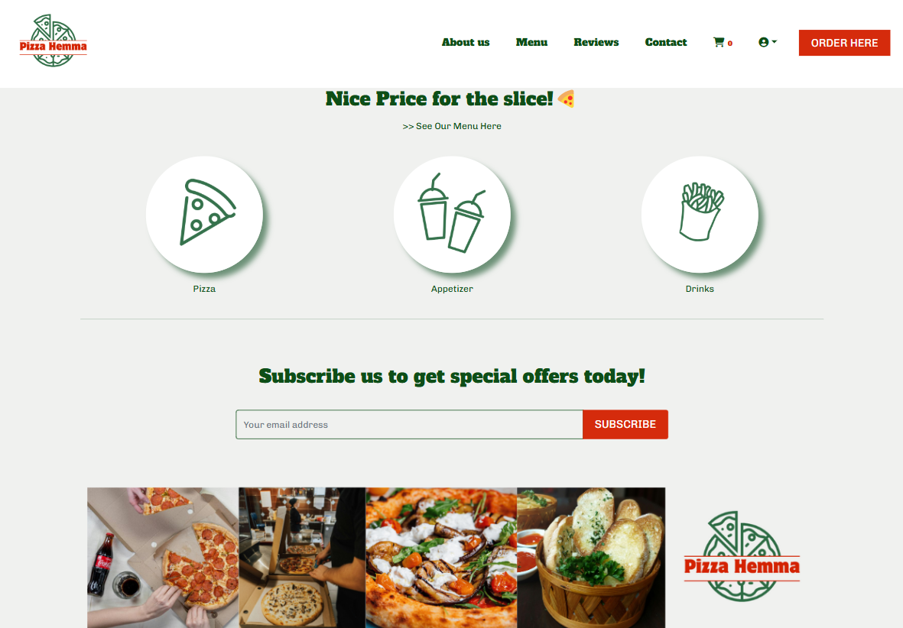

### About Us Page

- The About Us page introduces The Pizza Hemma Restaurant goals, introducing users to the restaurant story, values and love behind each pizza. It helps new users understand the site's goals and encourages them to come visit the restaurant or order online.

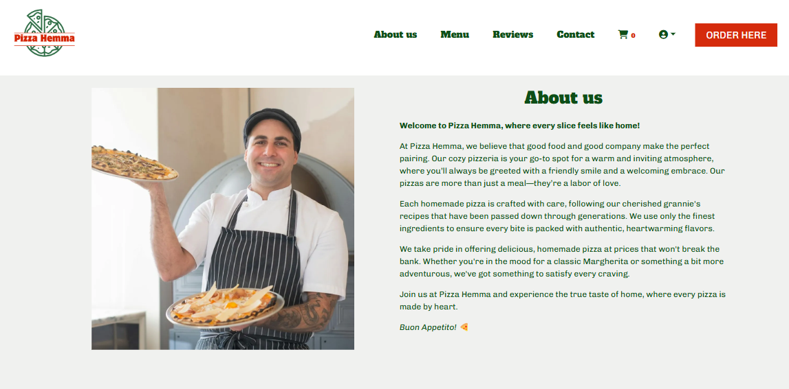

### Menu Page

- The Menu page initially displays the restaurant's full menu by default. To enhance accessibility and ensure user convenience, visitors can easily filter their search by selecting specific food categories, such as Pizza, Appetizers, Drinks, or viewing the complete menu. Moreover, a back-to-top button is conveniently located on the right side of the page, allowing users to return to the top with a single click for effortless navigation.

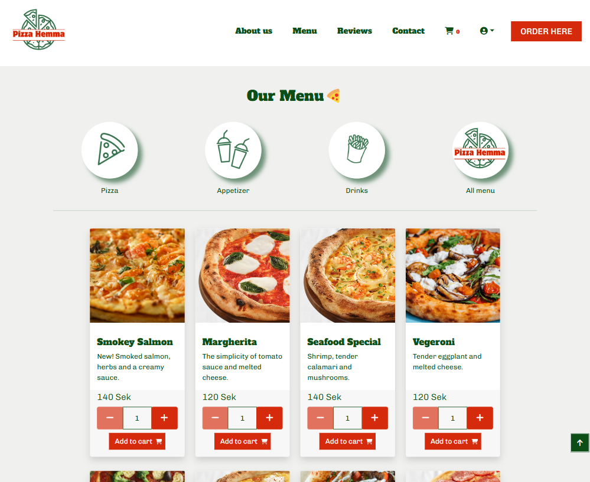

### Cart Page

- The cart page provides a comprehensive overview of your order details, including a menu image, menu name, price, quantity, subtotal, and delivery service information. It also features an "Order More" link and a checkout button to streamline the ordering process. Users can easily manage their cart with a plus-minus button to update item quantities and a remove function for effortless adjustments to their selections.

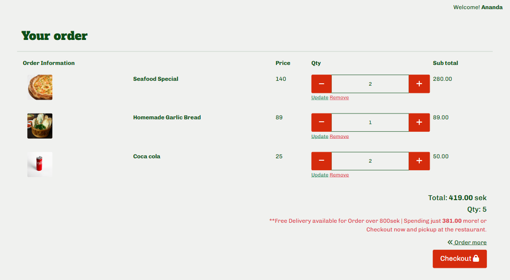

- When the cart is empty, there is a link to direct users to the menu page.

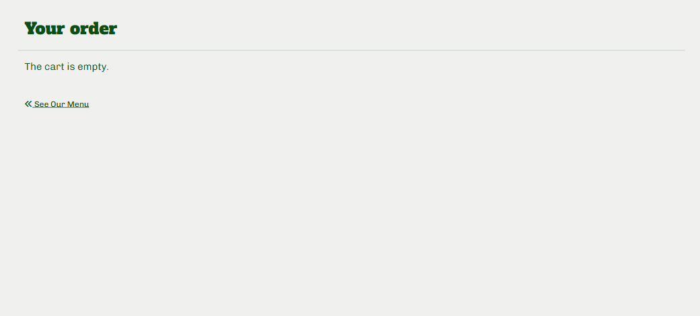

### Checkout Page

- The checkout page provides a clear overview of your order, including the order details, total cost, delivery fee, and the grand total. It features user information fields such as full name, email, phone number, and a delivery method, allowing users to choose between pick-up or delivery. Please note, the delivery service is only available within Gothenburg City. In the Address section, users can input their street address and postcode, with 'Gothenburg' set as the default city and 'SE' (Sweden) as the default country. To enhance convenience, the page includes links to create an account or log in, enabling users to save their information for future orders. Additional features include a payment field, an option to adjust the cart for any last-minute changes, and a "Complete Order" button for finalizing the purchase.

- User who is not registered will see this checkout page.

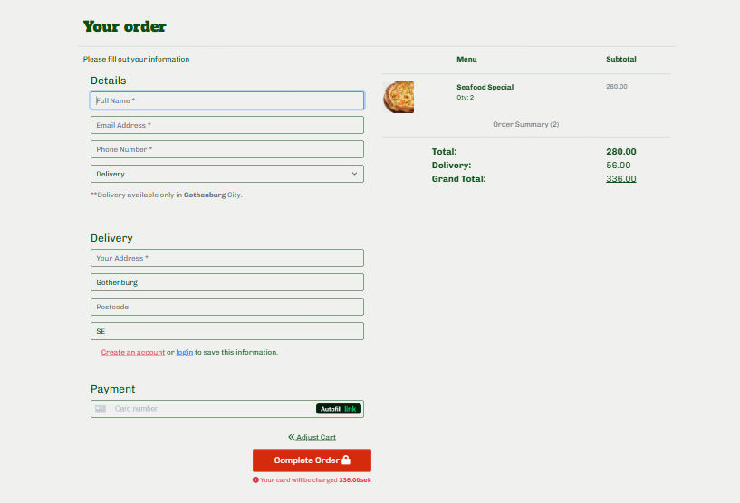

- User who is registered and has saved information on the profile will see this checkout page.

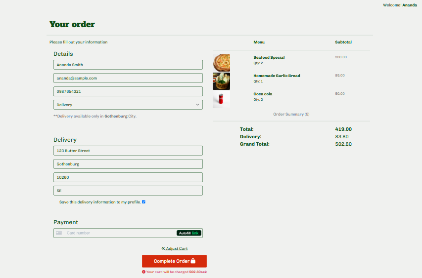

- The checkout Success page.

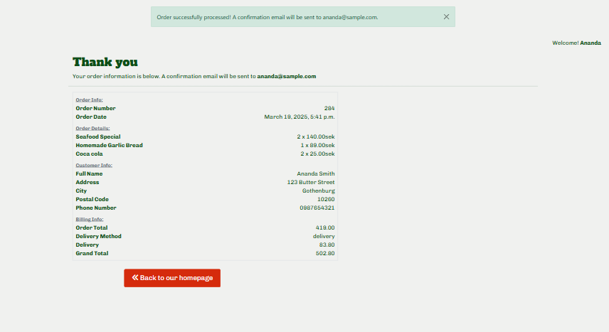

### Reviews Page

- The Reviews page plays a vital role in building trust and credibility for Pizza Hemma. It allows customers to share their experiences, creating a sense of community and encouraging others to visit the restaurant. The page features a layout displaying images of customers, followed by individual reviews that include the user's name, date, rating, written feedback, and an optional uploaded review image. While reviews are visible to all visitors, only registered members can submit them. Additionally, each review undergoes approval by the admin before it is published on the website, ensuring quality and relevance.

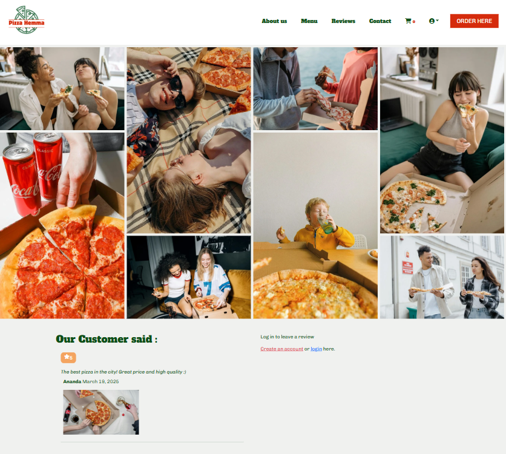

- When you are logged in as a member, you will be able to perform "CRUD Operations" to your own reviews.

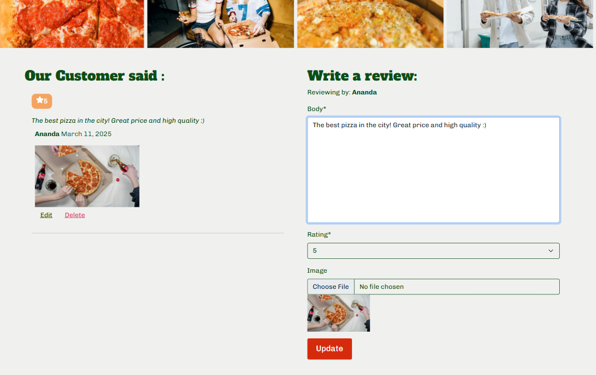

- The delete confirmation will pop up if user want to delete his/her reviews.

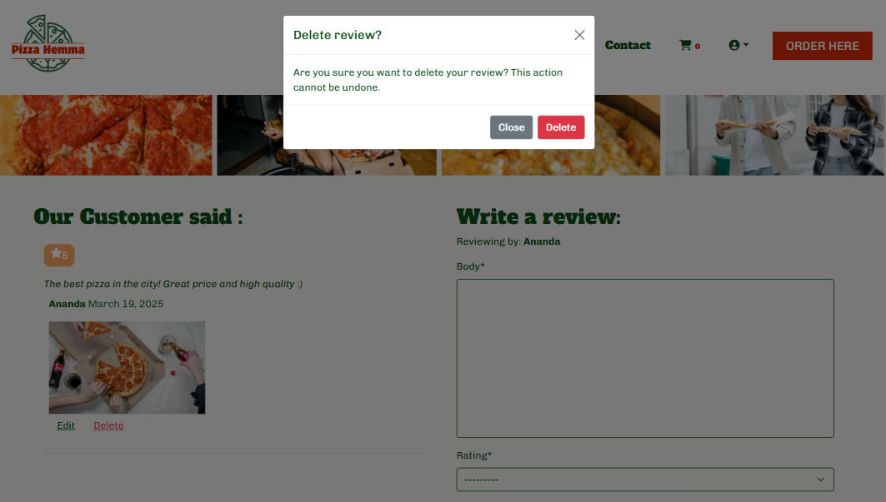

### Sign up Page

- The sign-up page features standard registration fields. After completing the registration process, users must verify their account through an email confirmation before gaining access to log in.

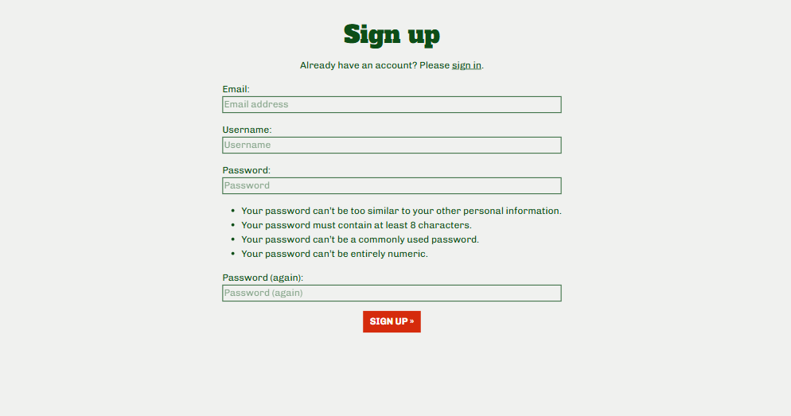

### Sign in Page

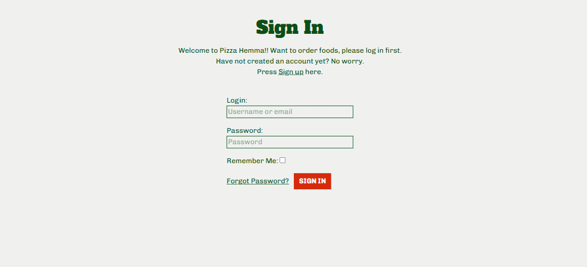

### Sign out Page


### Contact us Page

- The contact us page provides a direct way for users to contact with feedback or inquiries. Ensure users feel supported and have access to give feedback to the site owner, including inquiry of corporation partners. Additionally, I implemented user handlers for both authenticated and unauthenticated users to improve the user experience. Logged-in users only need to fill out the message field, as their details are automatically populated.

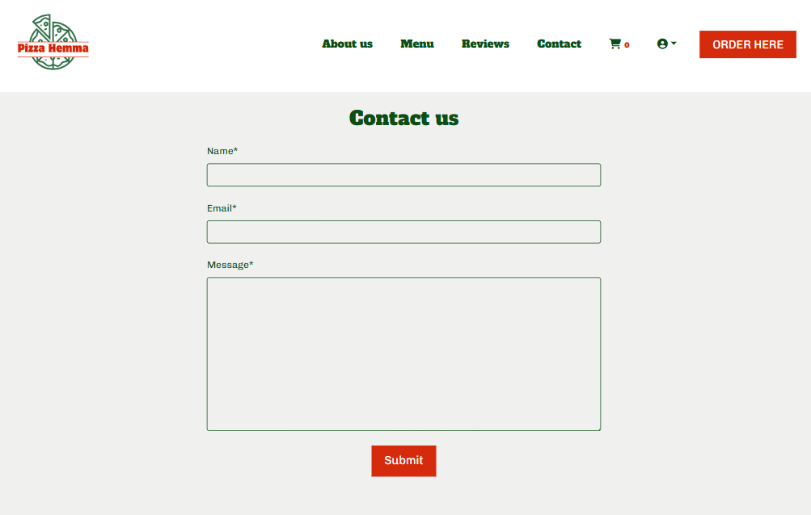

### Profile Page

- The profile page provides users with a personalized space to manage their account details. It allows them to update their personal information easily and includes an order history section where users can review their previous purchases. This feature enhances convenience by keeping all essential information in one place, saving users time and effort in tracking past orders or making updates. It also fosters a seamless and efficient user experience, encouraging repeat customers by offering them a sense of control and accessibility.


### The Footer Page

- The footer section provides essential information, including the restaurant's contact details, address, phone number, email, and opening hours. It also features social media icons that, when clicked, open in a new tab, allowing users to easily stay connected with Pizza Hemma across various platforms. This ensures convenient access to important details while fostering engagement through social media.

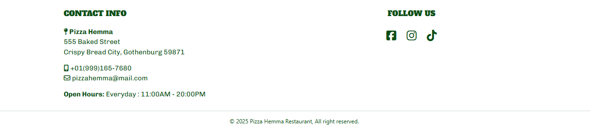

### Custom Error Handler Page

- Custom error page to ensure user-friendly navigation in any unexpected situations.

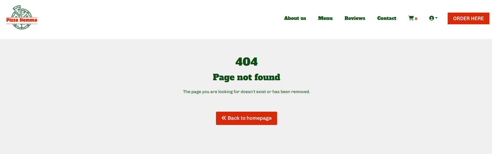

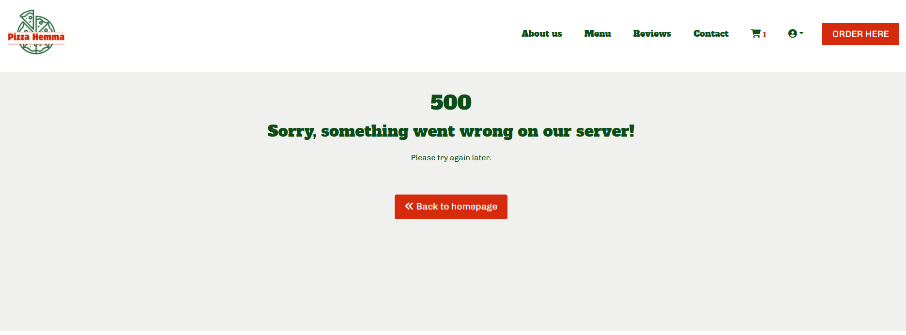

### Features left to implement

- A delivery tracking feature that allows users to monitor their order status in real-time and receive accurate updates on the estimated arrival time of their delivery.

## Testing

For all testing, please refer to the [TESTING.md](TESTING.md) file.

## Deployment & Local Deployment

### Deployment

The Live deployed application can be found deployed on [Heroku](https://pizza-hemma-4a540b28342f.herokuapp.com/).

### Database

This project uses [Neon.tech](https://www.neon.tech) for the PostgreSQL Database. This was provided by Code Institute via a database-maker website for Code Institute Students.

### Cloudinary API

This project uses the Cloudinary API to store media assets online, due to the fact that Heroku doesn't persist this type of data.

To obtain your own Cloudinary API key, create an account and log in.<br>
On your Cloudinary Dashboard, you can copy your API Environment Variable.<br>
Be sure to remove the CLOUDINARY_URL= as part of the API value; this is the key.

### Stripe API

This project uses [Stripe](https://stripe.com) to handle the ecommerce payments.

Once you've created a Stripe account and logged-in, follow these series of steps to get your project connected.

- From your Stripe dashboard, click to expand the "Get your test API keys".
- You'll have two keys here:
  - `STRIPE_PUBLIC_KEY` = Publishable Key (starts with **pk**)
  - `STRIPE_SECRET_KEY` = Secret Key (starts with **sk**)

As a backup, in case users prematurely close the purchase-order page during payment, we can include Stripe Webhooks.

- From your Stripe dashboard, click **Developers**, and select **Webhooks**.
- From there, click **Add Endpoint**.
  - `https://pizza-hemma-4a540b28342f.herokuapp.com/checkout/wh/`
- Click **receive all events**.
- Click **Add Endpoint** to complete the process.
- You'll have a new key here:
  - `STRIPE_WH_SECRET` = Signing Secret (Wehbook) Key (starts with **wh**)

### Gmail API

This project uses [Gmail](https://mail.google.com) to handle sending emails to users for account verification and purchase order confirmations.

Once you've created a Gmail (Google) account and logged-in, follow these series of steps to get your project connected.

- Click on the **Account Settings** (cog icon) in the top-right corner of Gmail.
- Click on the **Accounts and Import** tab.
- Within the section called "Change account settings", click on the link for **Other Google Account settings**.
- From this new page, select **Security** on the left.
- Select **2-Step Verification** to turn it on. (verify your password and account)
- Once verified, select **Turn On** for 2FA.
- Navigate back to the **Security** page, and you'll see a new option called **App passwords**.
- This might prompt you once again to confirm your password and account.
- Select **Mail** for the app type.
- Select **Other (Custom name)** for the device type.
  - Any custom name, such as "Django" or web-piano-academy
- You'll be provided with a 16-character password (API key).
  - Save this somewhere locally, as you cannot access this key again later!
  - `EMAIL_HOST_PASS` = user's 16-character API key
  - `EMAIL_HOST_USER` = user's own personal Gmail email address

### Local Deployment

This project can be cloned or forked in order to make a local copy on your own system.
For either method, you will need to install any applicable packages found within the _requirements.txt_ file.

- `pip3 install -r requirements.txt`.

You will need to create a new file called `env.py` at the root-level,
and include the same environment variables listed above from the Heroku deployment steps.

Sample `env.py` file:

```python
import os

os.environ.setdefault("CLOUDINARY_URL", "user's own value")
os.environ.setdefault("DATABASE_URL", "user's own value")
os.environ.setdefault("SECRET_KEY", "user's own value")

# local environment only (do not include these in production/deployment!)
os.environ.setdefault("DEBUG", "True")
```

Once the project is cloned or forked, in order to run it locally, you'll need to follow these steps:

- Start the Django app: `python3 manage.py runserver`
- Stop the app once it's loaded: `CTRL+C` or `⌘+C` (Mac)
- Make any necessary migrations: `python3 manage.py makemigrations`
- Migrate the data to the database: `python3 manage.py migrate`
- Create a superuser: `python3 manage.py createsuperuser`
- Load fixtures (if applicable): `python3 manage.py loaddata file-name.json` (repeat for each file)
- Everything should be ready now, so run the Django app again: `python3 manage.py runserver`

#### Forking repo on GitHub

By forking the GitHub Repository we make a copy of the original repository on our GitHub account to view and/or make changes without affecting the original repository by using the following steps...

1. Log in to GitHub and locate the [GitHub Repository](https://github.com/Chatlada-Nina/pizza-hemma)
2. At the top of the Repository (not top of page) just above the "Settings" Button on the menu, locate the "Fork" Button.
3. You should now have a copy of the original repository in your GitHub account.

#### Making a Local Clone

1. Log in to GitHub and locate the [GitHub Repository](https://github.com/Chatlada-Nina/pizza-hemma)
2. Under the repository name, click "Clone or download".
3. To clone the repository using HTTPS, under "Clone with HTTPS", copy the link.
4. Open Git Bash
5. Change the current working directory to the location where you want the cloned directory to be made.
6. Type `git clone`, and then paste the URL you copied in Step 3.

```
$ git clone https://github.com/YOUR-USERNAME/YOUR-REPOSITORY
```

7. Press Enter. Your local clone will be created.

```
$ git clone https://github.com/YOUR-USERNAME/YOUR-REPOSITORY
> Cloning into `CI-Clone`...
> remote: Counting objects: 10, done.
> remote: Compressing objects: 100% (8/8), done.
> remove: Total 10 (delta 1), reused 10 (delta 1)
> Unpacking objects: 100% (10/10), done.
```

### Heroku Deployment

The application was deployed to Heroku. In order to deploy, the following steps were taken:

1. If you have an account, login to Heroku. Otherwise create a new account.
2. Once signed in, click the "New" button in the top right corner, below the header and choose "Create new app".
3. Choose a unique name for the application and select your region. When done, click "Create app".
4. This brings you to the "Deploy" tab. From here, click the "Settings" tab and scroll down to the "Config Vars" section and click on "Reveal Config Vars" and set your environment variables.

| Key                     | Value                                                                |
| ----------------------- | -------------------------------------------------------------------- |
| `CLOUDINARY_URL`        | user's own value                                                     |
| `DATABASE_URL`          | user's own value                                                     |
| `DISABLE_COLLECTSTATIC` | 1 (_this is temporary, and can be removed for the final deployment_) |
| `SECRET_KEY`            | user's own value                                                     |

Heroku needs two additional files in order to deploy:

- requirements.txt
- Procfile

You can install this project's **requirements** (where applicable) using:

- `pip3 install -r requirements.txt`

If you have your own packages that have been installed, then the requirements file needs updated using:

- `pip3 freeze --local > requirements.txt`

The **Procfile** can be created with the following command:

- `echo web: gunicorn app_name.wsgi > Procfile`
- _replace **app_name** with the name of your primary Django app name; the folder where settings.py is located_

For Heroku deployment, follow these steps to connect your own GitHub repository to the newly created app:

Either:

- Select **Automatic Deployment** from the Heroku app.

Or:

- In the Terminal/CLI, connect to Heroku using this command: `heroku login -i`
- Set the remote for Heroku: `heroku git:remote -a app_name` (replace _app_name_ with your app name)
- After performing the standard Git `add`, `commit`, and `push` to GitHub, you can now type:
  - `git push heroku main`

The project should now be connected and deployed to Heroku!

## Credits

- I would like to thank you Code Institute tutors and slack channel community for guiding and helping me through the process of building my final project.
- I would like to thank you my husband and family for supporting and taking time to test my website and giving me valuable feedbacks.

### Content

- The menus were inspired and modified to suit the site from [Pizza Hut](https://www.pizzahut.co.th/)
- The description and the about us were modified from [Microsoft Copilot](https://copilot.microsoft.com/)
- The review texts were modified by me.

### Media

- Images on the homepage and reviews were taken from [Pexels](https://pexels.com/)
- Pizza Hemma logo, banner images were created by me.
- Most of pizza images were taken from [Pizza Hut](https://www.pizzahut.co.th/)
- Some pizza images, Appetizer and drink images were taken from [Unsplash](https://unsplash.com/)

### Code

The Boutique Ado walkthrough project laid a solid groundwork for building a full-stack website with the Django framework. It served as an essential guide for mastering key concepts such as user authentication and integrating e-commerce functionality. Similarly, my third project, BKK Coffee Corner, provided valuable inspiration, especially in organizing site content and enhancing the overall user experience. By drawing from the strengths of both projects, I successfully developed the Pizza Hemma Restaurant website with a clean and efficient codebase. The site integrates Django best practices while being carefully tailored to meet the specific needs of a local pizzeria business.

I have used various resources to help me with figuring out how to create the Pizza Hemma Restaurant Website:

- The Modal of confirmation was learned and modified from I Think Therefore I blog: CI learning platform.
- The rating system was learned and modified from [StackOverFlow Community](https://stackoverflow.com/questions/45845427/styling-an-integerfield-to-make-it-a-star-rating-system)
- Modified and combined components methods from documentations and tutorials on CI learning platform, [W3Schools](https://w3Schools.com/), [MDN Web Docs](https://developer.mozilla.org/en-US/) and [StackOverFlow](https://stackoverflow.co/)
- Templates for inspiration and creating my README.md and TESTING.md from [Sample README Code Institute](https://github.com/Code-Institute-Solutions/SampleREADME/blob/master/README.md?plain=1), [Hooked on fish-LemmenAid](https://github.com/LemmenAid/hooked-on-fish/blob/main/README.md) and [My Fishing Adventures-Markdanie1982](https://github.com/markdaniel1982/MD82-P4/blob/main/README.md)
- [Stripe](https://docs.stripe.com/get-started) To handle the ecommerce payments.
- [Django Ecommerce Project Youtube Tutorial](https://www.youtube.com/watch?v=qwFBXuEeg1U)
- [ChatGPT- used as an accelerating learning tool](https://chat.openai.com/)
- [Microsoft Copilot - used as an accelerating learning tool](https://copilot.microsoft.com/)
- [Learn Django - for the custom error pages](https://learndjango.com/tutorials/customizing-django-404-and-500-error-pages)
- [Studygyaan - Custom 500 Server Error Page Template in Django](https://studygyaan.com/django/how-to-use-custom-500-error-template-in-django)
- [Django Docs - for automated testing](https://docs.djangoproject.com/en/5.1/topics/testing/overview/)
- [Stack overflow](https://stackoverflow.com/)
- [Pep Style Guide](https://peps.python.org/pep-0008/)
- [W3Schools](https://www.w3schools.com/)
