# Testing

Return back to the [README.md](README.md) file.

## CONTENTS

- [AUTOMATED TESTING](#automated-testing)
  - [HTML](#html)
  - [CSS](#css)
  - [JavaScript](#javascript)
  - [Python](#python)
  - [Lighthouse](#lighthouse)
- [MANUAL TESTING](#manual-testing)
  - [Responsiveness](#responsiveness)
  - [Defensive Programming](#defensive-programming)
  - [User Story Testing](#user-story-testing)
- [SOLVED BUGS](#solved-bugs)

## AUTOMATED TESTING

### HTML

I have used the recommended [HTML W3C Validator](https://validator.w3.org) to validate all of my HTML files.

| Page             | Screenshot                                                         | Notes                                                                                                                                                                                                                                                                                                                                                                                                                                                                                                                                                                                                                                                                                                                                                                                                         |
| ---------------- | ------------------------------------------------------------------ | ------------------------------------------------------------------------------------------------------------------------------------------------------------------------------------------------------------------------------------------------------------------------------------------------------------------------------------------------------------------------------------------------------------------------------------------------------------------------------------------------------------------------------------------------------------------------------------------------------------------------------------------------------------------------------------------------------------------------------------------------------------------------------------------------------------- |
| Home             | 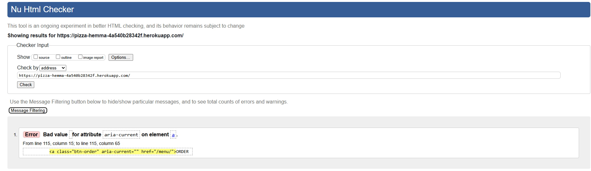         | The error occurs because the aria-current is empty and should be used when the link represents the current page. Since this is a standard navigation link and does not serve that purpose, the attribute was unnecessary and has been removed.                                                                                                                                                                                                                                                                                                                                                                                                                                                                                                                                                                |
| About            |             | The warning is about the article element is missing a heading inside it. To fix this, I move h2 and add p element inside the article element to properly associate them with the content.                                                                                                                                                                                                                                                                                                                                                                                                                                                                                                                                                                                                                     |
| Menu             |              | The warning is about the type of javascript attribute is unnecessary in modern HTML5 and no longer required so I have removed it.                                                                                                                                                                                                                                                                                                                                                                                                                                                                                                                                                                                                                                                                             |
| Contact Us       |           | Pass: No Errors                                                                                                                                                                                                                                                                                                                                                                                                                                                                                                                                                                                                                                                                                                                                                                                               |
| Cart             |              | Pass: No Errors                                                                                                                                                                                                                                                                                                                                                                                                                                                                                                                                                                                                                                                                                                                                                                                               |
| Checkout         |          | 1.) The warning occurs because XML doesn't allow consecutive hyphens(--) in comments so I replaced them with a valid format. 2.) The error occurs because the placeholder attribute is not valid for the select element in HTML. To resolve this, I removed the placeholder from the delivery_method field so that it no longer has a placeholder. Additionally, I updated the loop to bypass adding the placeholder for the delivery_method field while preserving the existing logic for other fields. This modification allows Django to render the default select dropdown as intended. 3.) The warning is caused by having an empty heading (h1). To improve accessibility for screen readers, I added span with text "Loading...", added class sr-only to keep it visually hidden but still accessible. |
| Checkout Success |  | Pass: No Errors                                                                                                                                                                                                                                                                                                                                                                                                                                                                                                                                                                                                                                                                                                                                                                                               |
| Reviews          |           | This error come from myself copied the code from another part of the site which in this page, doesn't need label for so I have replace label element with p element.                                                                                                                                                                                                                                                                                                                                                                                                                                                                                                                                                                                                                                          |
| Profile          |           | The validation error arises from the default Django form rendering engine used by allauth, which generates the HTML automatically. This issue originates from how Django's crispy-forms library renders form errors by default. Since this is not code I have written manually but part of the third-party package’s default behavior, I have chosen to leave it as is, as it does not impact the website’s functionality.                                                                                                                                                                                                                                                                                                                                                                                    |
| Login            |             | Pass: No Errors                                                                                                                                                                                                                                                                                                                                                                                                                                                                                                                                                                                                                                                                                                                                                                                               |
| Logout           |           | Pass: No Errors                                                                                                                                                                                                                                                                                                                                                                                                                                                                                                                                                                                                                                                                                                                                                                                               |
| Signup           |            | The validation error arises from the default Django form rendering engine used by allauth, which generates the HTML automatically. This issue originates from how Django's crispy-forms library renders form errors by default. Since this is not code I have written manually but part of the third-party package’s default behavior, I have chosen to leave it as is, as it does not impact the website’s functionality.                                                                                                                                                                                                                                                                                                                                                                                    |
| Custom Error 404 |          | Pass: No Errors                                                                                                                                                                                                                                                                                                                                                                                                                                                                                                                                                                                                                                                                                                                                                                                               |
| Custom Error 500 |          | Pass: No Errors                                                                                                                                                                                                                                                                                                                                                                                                                                                                                                                                                                                                                                                                                                                                                                                               |

### CSS

I have used the recommended [CSS Jigsaw Validator](https://jigsaw.w3.org/css-validator) to validate my CSS file.

| Page      | Screenshot                                                     | Notes           |
| --------- | -------------------------------------------------------------- | --------------- |
| style.css |  | Pass: No Errors |

### JavaScript

I have used the recommended [JShint Validator](https://jshint.com) to validate all of my JS files. After inserting /*jshint esversion: 6/, /*global $/, stripe and bootstrap/ at the top of the files no errors were returned.

| File               | Screenshot                                                         | Notes |
| ------------------ | ------------------------------------------------------------------ | ----- |
| menu.js            |             | Pass  |
| reviews.js         |          | Pass  |
| stripe_elements.js |  | Pass  |

### Python

I have used the recommended [PEP8 CI Python Linter](https://pep8ci.herokuapp.com) to validate all of my Python files. No errors were returned:

#### Validation For Pizza Hemma App

| File        | Screenshot                                                              | Notes           |
| ----------- | ----------------------------------------------------------------------- | --------------- |
| asgi.py     |      | Pass: No Errors |
| settings.py |  | Pass: No Errors |
| urls.py     |      | Pass: No Errors |
| views.py    |     | Pass: No Errors |
| wsgi.py     |      | Pass: No Errors |

#### Validation For about App

| File      | Screenshot                                                       | Notes           |
| --------- | ---------------------------------------------------------------- | --------------- |
| admin.py  | 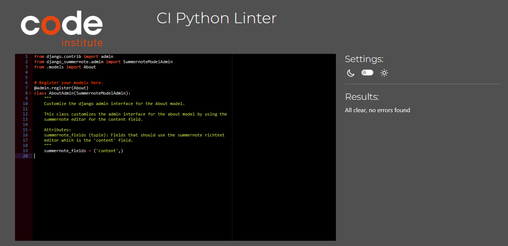  | Pass: No Errors |
| apps.py   | 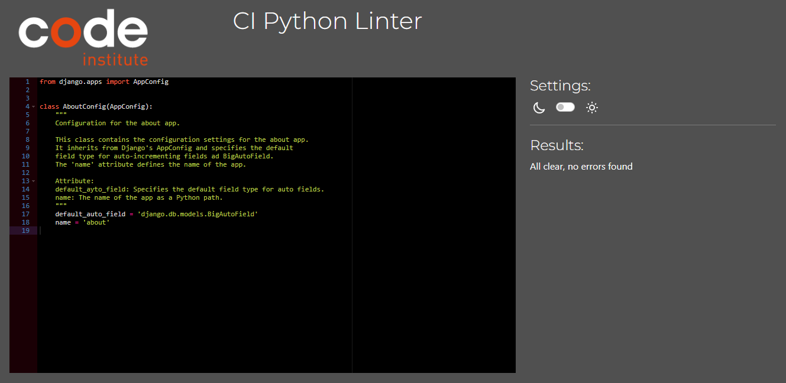   | Pass: No Errors |
| models.py |  | Pass: No Errors |
| tests.py  |   | Pass: No Errors |
| urls.py   |    | Pass: No Errors |
| views.py  | 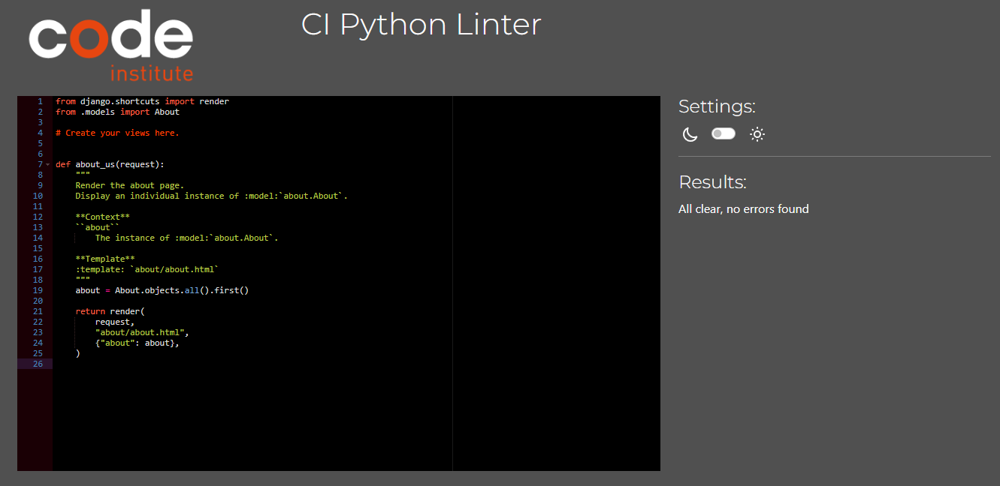  | Pass: No Errors |

#### Validation For Contact App

| File      | Screenshot                                                         | Notes           |
| --------- | ------------------------------------------------------------------ | --------------- |
| admin.py  |   | Pass: No Errors |
| apps.py   |    | Pass: No Errors |
| forms.py  |   | Pass: No Errors |
| models.py |  | Pass: No Errors |
| tests.py  |   | Pass: No Errors |
| urls.py   |    | Pass: No Errors |
| views.py  |   | Pass: No Errors |

#### Validation For Home App

| File      | Screenshot                                                      | Notes           |
| --------- | --------------------------------------------------------------- | --------------- |
| admin.py  |   | Pass: No Errors |
| apps.py   |    | Pass: No Errors |
| models.py |  | Pass: No Errors |
| tests.py  |   | Pass: No Errors |
| urls.py   |    | Pass: No Errors |
| views.py  |   | Pass: No Errors |

#### Validation For Reviews App

| File      | Screenshot                                                         | Notes           |
| --------- | ------------------------------------------------------------------ | --------------- |
| admin.py  |   | Pass: No Errors |
| apps.py   |    | Pass: No Errors |
| forms.py  |   | Pass: No Errors |
| models.py |  | Pass: No Errors |
| urls.py   |    | Pass: No Errors |
| views.py  |   | Pass: No Errors |

#### Validation For Profiles App

| File      | Screenshot                                                          | Notes           |
| --------- | ------------------------------------------------------------------- | --------------- |
| apps.py   |    | Pass: No Errors |
| forms.py  |   | Pass: No Errors |
| models.py |  | Pass: No Errors |
| urls.py   |    | Pass: No Errors |
| views.py  |   | Pass: No Errors |

#### Validation For Cart App

| File        | Screenshot                                                        | Notes           |
| ----------- | ----------------------------------------------------------------- | --------------- |
| apps.py     |      | Pass: No Errors |
| contexts.py |  | Pass: No Errors |
| tests.py    |     | Pass: No Errors |
| urls.py     |      | Pass: No Errors |
| views.py    |     | Pass: No Errors |

#### Validation For Checkout App

| File               | Screenshot                                                                   | Notes           |
| ------------------ | ---------------------------------------------------------------------------- | --------------- |
| apps.py            | 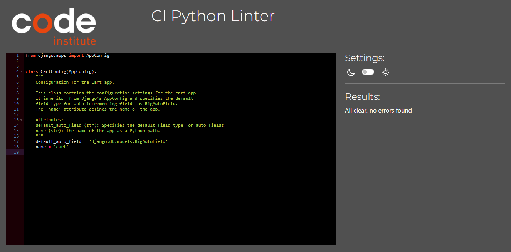            | Pass: No Errors |
| forms.py           |            | Pass: No Errors |
| models.py          |           | Pass: No Errors |
| signals.py         | 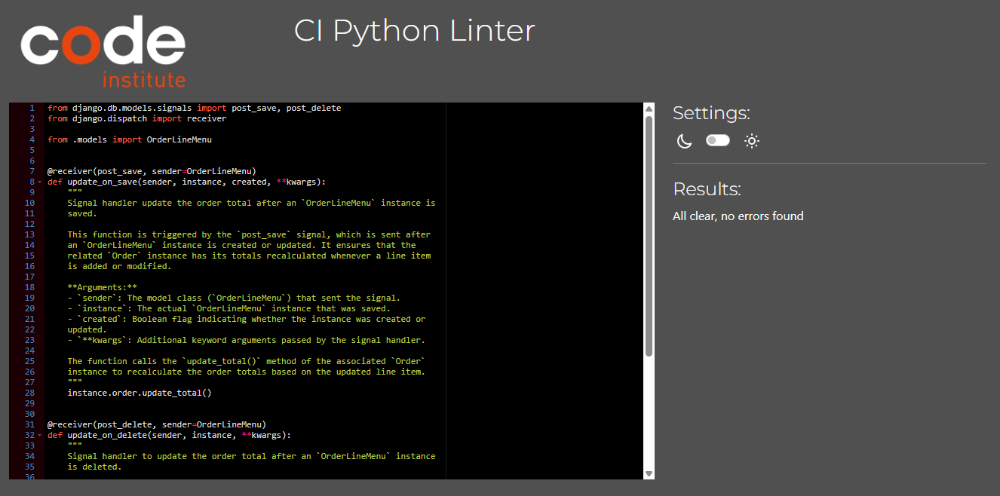         | Pass: No Errors |
| urls.py            |             | Pass: No Errors |
| views.py           |            | Pass: No Errors |
| webhook-handler.py |  | Pass: No Errors |
| webhooks.py        |         | Pass: No Errors |

#### Validation For Menu App

| File      | Screenshot                                                      | Notes           |
| --------- | --------------------------------------------------------------- | --------------- |
| apps.py   |    | Pass: No Errors |
| forms.py  |   | Pass: No Errors |
| models.py |  | Pass: No Errors |
| urls.py   |    | Pass: No Errors |
| views.py  |   | Pass: No Errors |

### Python (Unit Testing)

I have used Django's built-in unit testing framework to test Home, About, Contact and Cart application functionality.

In order to run the tests, I ran the following command in the terminal each time:

`python manage.py test name-of-app `

Below are the results from the various apps on my application that I've tested:

| App     | File     | Result | Screenshot                                                 |
| ------- | -------- | ------ | ---------------------------------------------------------- |
| Home    | tests.py | OK     | 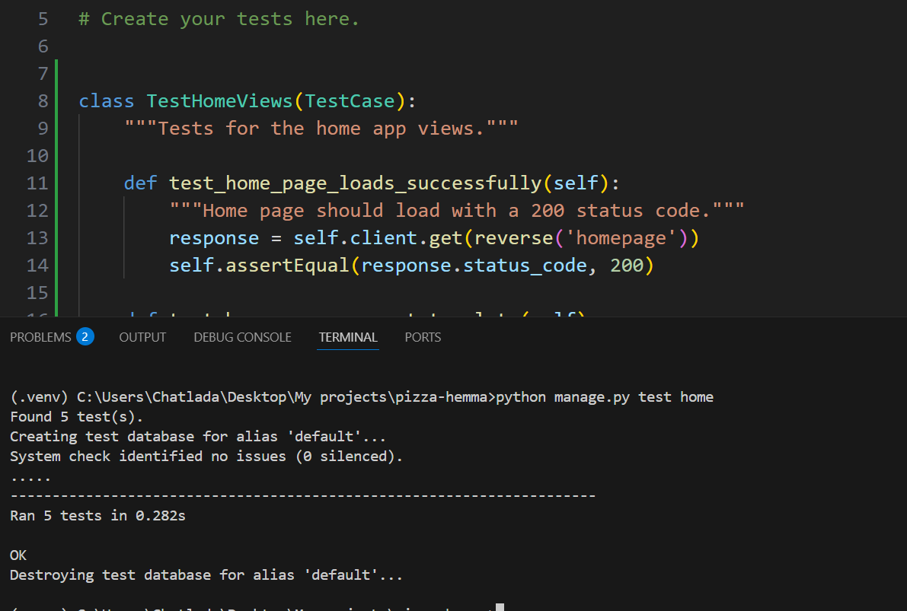    |
| About   | tests.py | OK     |    |
| Contact | tests.py | OK     |  |
| Cart    | tests.py | OK     |     |

### Lighthouse

I've audited my deployed project with the Lighthouse tool to identify any significant issues. Overall, I'm pleased with the results. However, it's worth noting that the 'Best Practices' score is notably affected by the Cloudinary images.

| Page       | Size    | Screenshot                                                   |
| ---------- | ------- | ------------------------------------------------------------ |
| Home       | Desktop |      |
| About      | Desktop |     |
| Menu       | Desktop |      |
| reviews    | Desktop |   |
| checkout   | Desktop |  |
| My Profile | Desktop |   |
| Contact us | Desktop |   |
| Sign In    | Desktop | 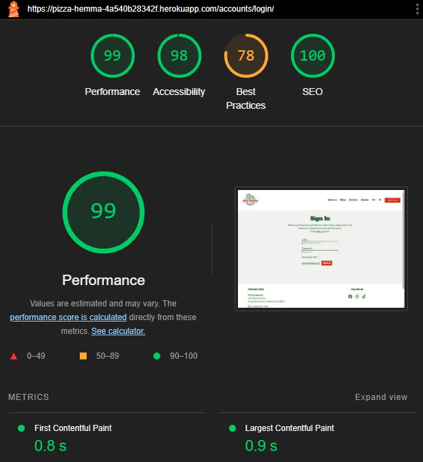   |
| Sign Up    | Desktop |    |

## MANUAL TESTING

### Responsiveness

Full responsive testing was performed on the following devices:

- Laptop:
  - Lenovo Ideapad 14 inch screen
- Mobile Devices:
  - IPhone 13
  - Samsung galaxy Note 9

Each device tested the site using the following browsers:

- Google Chrome
- Safari

### Defensive Programming

Defensive programming was manually tested with the below user acceptance testing:

| Page                                      | User Action                                                                            | Expected Result                                                                       | Pass/Fail | Comments |
| ----------------------------------------- | -------------------------------------------------------------------------------------- | ------------------------------------------------------------------------------------- | --------- | -------- |
| **Navigation bar**                        |                                                                                        |                                                                                       |           |          |
|                                           | Click on Logo                                                                          | Redirection to Home page                                                              | Pass      |          |
|                                           | Click on About us in navbar                                                            | Redirection to About us page                                                          | Pass      |          |
|                                           | Click on Menu in navbar                                                                | Redirection to Menu page                                                              | Pass      |          |
|                                           | Click on Reviews                                                                       | Redirection to Reviews page                                                           | Pass      |          |
|                                           | Click on Contact in navbar                                                             | Redirection to Contact page                                                           | Pass      |          |
|                                           | Click on Cart icon                                                                     | Redirection to Cart page                                                              | Pass      |          |
|                                           | Click on Account icon                                                                  | Dropdown menu displays Login and Register                                             | Pass      |          |
|                                           | Click on Register in the dropdown                                                      | Redirection to Sign-up form page                                                      | Pass      |          |
|                                           | Click on Login in dropdown                                                             | Redirection to Sign-in page                                                           | Pass      |          |
| **Footer**                                |                                                                                        |                                                                                       |           |          |
|                                           | Click on each social media icon                                                        | Redirection to each social media website                                              | Pass      |          |
| **Home page**                             |                                                                                        |                                                                                       |           |          |
|                                           | Click on ORDER NOW button                                                              | Redirection to Menu page                                                              | Pass      |          |
|                                           | Click on 'See Our Menu Here' link                                                      | Redirection to Menu page                                                              | Pass      |          |
|                                           | Click on Pizza image/link                                                              | Redirection to Menu Category:Pizza page                                               | Pass      |          |
|                                           | Click on Appetizer image/link                                                          | Redirection to Menu Category:Appetizer page                                           | Pass      |          |
|                                           | Click on Drinks image/link                                                             | Redirection to Menu Category:Drinks page                                              | Pass      |          |
|                                           | Type valid email in the subsribe field and click SUBSCRIBE                             | message displays"(email) was successfully subscibed!"                                 | Pass      |          |
|                                           | Type registered email in the subsribe field and click SUBSCRIBE                        | The message displays"Found registered email with (email).You must login to subscribe" | Pass      |          |
|                                           | Type subscribed email in the subsribe field and click SUBSCRIBE                        | The message displays"(email) is already subscribed!"                                  | Pass      |          |
|                                           | Type any text in the subsribe field and click SUBSCRIBE                                | The warning message pop-up                                                            | Pass      |          |
| **Menu page**                             |                                                                                        |                                                                                       |           |          |
|                                           | Click on Pizza image/link                                                              | Display only Menu Category:Pizza                                                      | Pass      |          |
|                                           | Click on Appetizer image/link                                                          | Display only Menu Category:Appetizer                                                  | Pass      |          |
|                                           | Click on Drinks image/link                                                             | Display only Menu Category:Drinks                                                     | Pass      |          |
|                                           | Click on Logo image/All menu link                                                      | Display all Menu                                                                      | Pass      |          |
|                                           | Click on plus(+) button                                                                | The number increase by 1 at a time with maximum value 99                              | Pass      |          |
|                                           | Click on minus(-) button                                                               | The number decrease by 1 at a time with minimum value 1                               | Pass      |          |
|                                           | Click on Add to cart button                                                            | The number on the cart icon on the navbar displays quantity of the item you selected  | Pass      |          |
|                                           | Click on the arrow-up icon on the right side of the page                               | Redirect to the top of the menu page                                                  | Pass      |          |
| **Reviews page (not logged in)**          |                                                                                        |                                                                                       |           |          |
|                                           | Click on 'Create an account' link                                                      | Redirection to Register form page                                                     | Pass      |          |
|                                           | Click on 'login' link                                                                  | Redirection to Sign-in form page                                                      | Pass      |          |
| **Reviews page (Logged in as a member)**  |                                                                                        |                                                                                       |           |          |
|                                           | On the review form, Fill out Body field without select any Rating and click Submit     | The required message pop-up                                                           | Pass      |          |
|                                           | On the review form, Select the Rating without fill out the Body field and click Submit | The required message pop-up                                                           | Pass      |          |
|                                           | On the review form, Fill out Body field and select the Rating and click Submit         | The Success message pop-up                                                            | Pass      |          |
|                                           | Click on Edit link on the existing reviews                                             | The existing body text, rating and image(if uploaded) displays on the review form     | Pass      |          |
|                                           | After updating the existing review and click submit                                    | The Success message pop-up, the updated review displays on the review page.           | Pass      |          |
|                                           | Click Delete link on the existing reviews                                              | The delete confirmation pop-up                                                        | Pass      |          |
| **Contact Page**                          |                                                                                        |                                                                                       |           |          |
|                                           | Leave the name input empty and try to click Submit                                     | A required message popped up                                                          | Pass      |          |
|                                           | Leave the email input empty and try to click Submit                                    | A required message popped up                                                          | Pass      |          |
|                                           | Leave the message input empty and try to click Submit                                  | A required message popped up                                                          | Pass      |          |
|                                           | Fill out all input correctly and click Submit                                          | A confirmation message popped up                                                      | Pass      |          |
| **Cart Page (empty cart)**                |                                                                                        |                                                                                       |           |          |
|                                           | Click on 'See Our Menu' link                                                           | Redirect to the menu page                                                             | Pass      |          |
| **Cart Page (with items)**                |                                                                                        |                                                                                       |           |          |
|                                           | Click on plus(+) button                                                                | The number increase by 1 at a time with maximum value 99                              | Pass      |          |
|                                           | Click on minus(-) button                                                               | The number decrease by 1 at a time with minimum value 1                               | Pass      |          |
|                                           | Click on 'Update' link                                                                 | The quantity updated, total price recalculated and Qty recounted.                     | Pass      |          |
|                                           | Click on 'Remove' link                                                                 | The menu item removed, total price recalculated and Qty recounted.                    | Pass      |          |
|                                           | Click on 'Order more' link                                                             | Redirect to the menu page                                                             | Pass      |          |
|                                           | Click on 'Checkout' button                                                             | Redirect to the Checkout page                                                         | Pass      |          |
| **Checkout Page (not logged in)**         |                                                                                        |                                                                                       |           |          |
|                                           | Click 'Complete Order' without fill out the card payment                               | The warning displays 'Your card number is incomplate'                                 | Pass      |          |
|                                           | Fill out the card payment but leave some input field empty                             | The required message pop-up                                                           | Pass      |          |
|                                           | All fields with \* must be filled out if not                                           | The required message pop-up                                                           | Pass      |          |
|                                           | Click 'Create account' link                                                            | Redirect to Signup form page                                                          | Pass      |          |
|                                           | Click 'login' link                                                                     | Redirect to Sign-in form page                                                         | Pass      |          |
|                                           | Click 'Adjust Cart' link                                                               | Redirect back to cart page                                                            | Pass      |          |
|                                           | Filled out all required fields and valid payment card and click Complete Order         | Redirect to the Checkout success page and the success message pop-up                  | Pass      |          |
| **Checkout Page (logged in as a member)** |                                                                                        |                                                                                       |           |          |
|                                           | Click 'Complete Order' without fill out the card payment                               | The warning displays 'Your card number is incomplate'                                 | Pass      |          |
|                                           | Fill out the card payment but leave some input field empty                             | The required message pop-up                                                           | Pass      |          |
|                                           | All fields with \* must be filled out if not                                           | The required message pop-up                                                           | Pass      |          |
|                                           | Click 'Adjust Cart' link                                                               | Redirect back to cart page                                                            | Pass      |          |
|                                           | Filled out all required fields and valid payment card and click Complete Order         | Redirect to the Checkout success page and the success message pop-up                  | Pass      |          |
| **Checkout Success Page**                 |                                                                                        |                                                                                       |           |          |
|                                           | Click 'Back to homepage'                                                               | Redirects user to Home page                                                           | Pass      |          |
| **My Profile Page**                       |                                                                                        |                                                                                       |           |          |
|                                           | Click 'Update Information'                                                             | Delivery Information update and the success message pop-up                            | Pass      |          |
|                                           | On the Order history section, click on an old order number                             | Redirect to that old order number information with the info message pop-up            | Pass      |          |
|                                           | On the old order number history page, click on the 'Back to my profile'                | Redirect to the Profile page                                                          | Pass      |          |
| **Signup Page**                           |                                                                                        |                                                                                       |           |          |
|                                           | Click sign in link                                                                     | Redirect user to Login page                                                           | Pass      |          |
|                                           | Leave the name input empty and try to click Submit                                     | A required message pop-up                                                             | Pass      |          |
|                                           | Leave the email input empty and try to click Submit                                    | A required message pop-up                                                             | Pass      |          |
|                                           | Enter valid password (twice)                                                           | Field will only accept password format                                                | Pass      |          |
|                                           | Click on Sign Up button                                                                | A confirmation message pop-up, user must verify the email before login                | Pass      |
| **Login Page**                            |                                                                                        |                                                                                       |           |          |
|                                           | Click sign up link                                                                     | Redirects user to Sign up page                                                        | Pass      |          |
|                                           | Enter valid username                                                                   | Field will only accept username format                                                | Pass      |          |
|                                           | Enter valid password                                                                   | Field will only accept password format                                                | Pass      |          |
|                                           | Click 'Forgot Password'                                                                | Redirect to the password reset page                                                   | Pass      |          |
|                                           | Fill out valid email and click 'reset password'                                        | Redirect to the password reset done page with information                             | Pass      |          |
| **Log Out**                               |                                                                                        |                                                                                       |           |          |
|                                           | Click Logout button                                                                    | Logs out user, a confirmation message popped up and Redirects user to home page       | Pass      |
| **Site buttons and links**                |                                                                                        |                                                                                       |           |          |
|                                           | Hover effect buttons                                                                   | hover effect for buttons across the site the background colour change                 | Pass      |
|                                           | Hover effect Navbar links                                                              | hover effect for navbar links across the site the under-line appear and colour change | Pass      |
|                                           | Hover effect other links                                                               | hover effect for other links across the site the colour change                        | Pass      |
|                                           | Hover effect Social media icons                                                        | hover effect for Social media icons across the site the colour change                 | Pass      |

| User Story                                                                                                                             | Screenshot                                                                                                                             |
| -------------------------------------------------------------------------------------------------------------------------------------- | -------------------------------------------------------------------------------------------------------------------------------------- |
| As a new user, I can create an account so that I can save my personal details and preferences for a personalized experience.           | 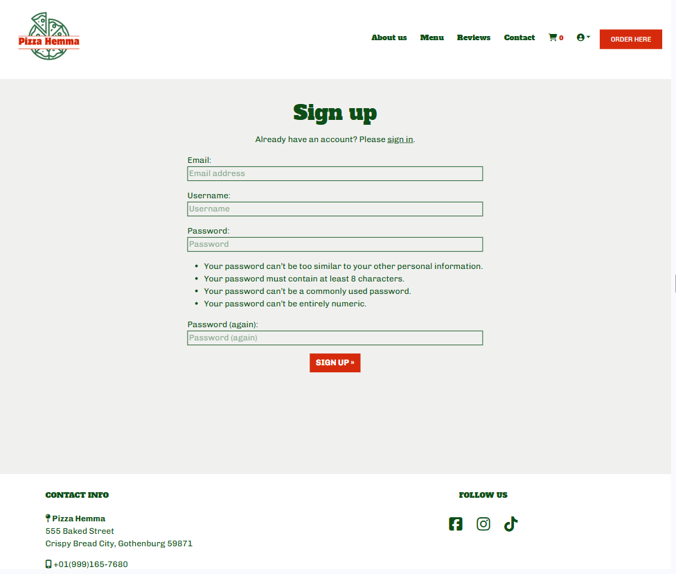                                                                             |
| As a user, I can log in and log out so that I can securely access my account and order history.                                        |                                                                              |
| As a user, I can browse the menu so that I can see all the pizzas and other menus and their details.                                   |                                                                                |
| As a user, I can see my order details and price so that I can make sure my order is correct before payment.                            |                                                                                |
| As a user, I can add pizzas to my cart or delete pizzas from my cart so that I can place a correct order for my favorite pizzas.       |                                                              |
| As a user, I can choose to place an order online so that I can get my pizza delivered or pick it up from the restaurant.               |                                                                     |
| As a user, I can place an order online so that I can get my pizza delivered from the restaurant.                                       | 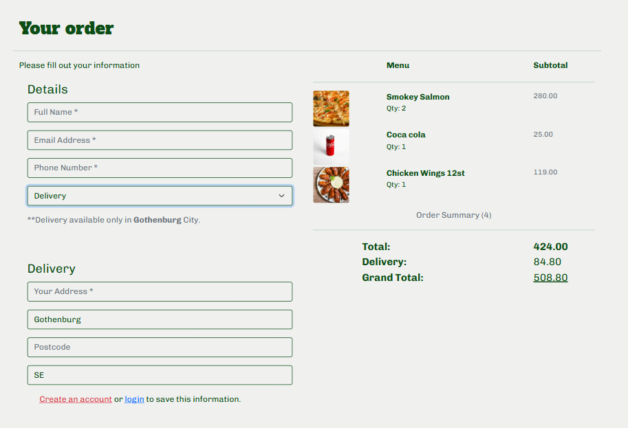                                                                      |
| As a user, I can make secure payments easily so that I can pay for my order online through the website.                                | 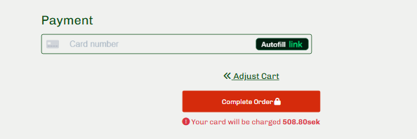                                                                            |
| As a user, I can receive a receipt after a successful payment so that I have proof of my purchase.                                     |   |
| As a user, I can update my profile information so that I can keep my contact details and preferences up to date.                       |                                                                             |
| As a user, I can subscribe to special offers so that I can receive exclusive deals and promotions.                                     |                                                                        |
| As an admin, I can add new pizzas and ingredients to the menu so that I can keep the menu up to date with new offerings.               |                                                                    |
| As an admin, I can manage user accounts so that I can assist users with account-related issues and maintain security.                  |                                                                       |
| As an admin, I can view and manage orders so that I can ensure timely preparation and delivery of pizzas.                              |                                                                         |
| As an admin, I can monitor and respond to user feedback so that I can address any issues and improve the restaurant's service.         |                                                                       |
| As a user, I can leave feedback and reviews for pizzas so that I can share my dining experience and help others make informed choices. |                                                                             |

### Solved Bugs

- When I clicked the remove link on the cart page, the item was not being removed from the cart in the session. After spending hours troubleshooting the issue, I discovered that I had mistakenly specified menu_id as an integer in urls.py when it should have been a string. This caused the item not to be found and removed as expected. To resolve the issue, I removed the int: term so that the URL parameter menu_id would be treated as a string, as it should be.

- During testing the stripe payment, I found that when I select Delivery Method: pickup, the grand total is showing correctly on the checkout page. However, Stripe (via webhook) is still adding the delivery cost to the grand total (even when the method is set to "pickup"). Efter many hours of looking at what the issue was and where. I found that it might be the grand total and delivery cost did not separate consistently before passing the data to Stripe. I was passing the grand total as total in checkout, but not considering the correct separation of delivery cost for the Stripe PaymentIntent.To fix the issue, I added a calculation total and delivery cost and then stored delivery cost and method for Stripe before saving order, passing the delivery method and delivery cost in the metadata on my checkout views.py. Also add `request.session.modified = True` to make sure the session is updated.

  - On webhook_handler.py, I added a recalculation gran_total to make sure it’s correct before saving. Ensured that delivery costs are only added when "delivery" is selected, I used Decimal(0) to avoid potential floating-point issues.
  - On checkout/forms.py, I added 'delivery_method' to placeholders to ensure that when `self.fields['delivery_method']` is processed, it won't raise an error.
  - On Confirmation_email_body.txt, I added the condition for the delivery method to make it easier and clearer for users.
  - On views.py, I added `delivery_method = request.POST.get('delivery_method', 'not_specified')` to log and send the correct data to Stripe and passed the delivery method to metadata before creating the payment intent.

- The uploaded image on the reviews page was not appearing on the website because I did not use `mutipart/form-data` to handle file uploads. To resolve this issue, I updated the review form by adding `enctype="multipart/form-data"` and modified `views.py` to include `request.FILES` . These changes ensured that the form properly saved the uploaded file and displayed it on the site as intended.

- One of my users reported that each time they clicked "Add an Item," the menu page would reload and return to the top, requiring them to scroll back down to their previous position. To enhance the user experience, I implemented a JavaScript functionality on `menu/includes/quantity_input_script.html` that preserves the scroll position before form submission and restores it after the page reloads.

- I found the issue where the name field in the contact form was not being populated correctly. This occurred because the hidden input fields I had set were not binding to the form’s fields. To address this, I removed the hidden input fields for both the name and email, and instead utilized initial data to auto-populate these fields. Additionally, I implemented fallback logic in to handle cases where authenticated users haven’t set a full name. In such scenarios, the name field will now default to the username, effectively resolving the issue of an empty name field.
