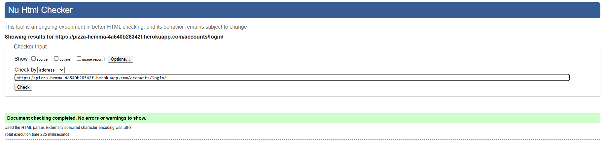

# Testing

Return back to the [README.md](README.md) file.

## CONTENTS

- [AUTOMATED TESTING](#automated-testing)
  - [HTML](#html)
  - [CSS](#css)
  - [JavaScript](#javascript)
  - [Python](#python)
  - [Lighthouse](#lighthouse)
- [MANUAL TESTING](#manual-testing)
  - [Responsiveness](#responsiveness)
  - [Defensive Programming](#defensive-programming)
  - [User Story Testing](#user-story-testing)
- [SOLVED BUGS](#solved-bugs)

## AUTOMATED TESTING

### HTML

I have used the recommended [HTML W3C Validator](https://validator.w3.org) to validate all of my HTML files.

| Page       | Screenshot                                                 | Notes                                                                                                                                                                                                                                                                                                                                                                                                                      |
| ---------- | ---------------------------------------------------------- | -------------------------------------------------------------------------------------------------------------------------------------------------------------------------------------------------------------------------------------------------------------------------------------------------------------------------------------------------------------------------------------------------------------------------- |
| Home       |  | The error occurs because the aria-current is empty and should be used when the link represents the current page. Since this is a standard navigation link and does not serve that purpose, the attribute was unnecessary and has been removed.                                                                                                                                                                             |
| About      |     | The warning is about the article element is missing a heading inside it. To fix this, I move h2 and add p element inside the article element to properly associate them with the content.                                                                                                                                                                                                                                  |
| Menu       |      | The warning is about the type of javascript attribute is unnecessary in modern HTML5 and no longer required so I have removed it.                                                                                                                                                                                                                                                                                          |
| Contact Us |   | Pass: No Errors                                                                                                                                                                                                                                                                                                                                                                                                            |
| Cart       |      | Pass: No Errors                                                                                                                                                                                                                                                                                                                                                                                                            |
| Checkout   |  |
| Reviews    |   | This error come from myself copied the code from another part of the site which in this page, doesn't need label for so I have replace label element with p element.                                                                                                                                                                                                                                                       |
| Profile    |   | The validation error arises from the default Django form rendering engine used by allauth, which generates the HTML automatically. This issue originates from how Django's crispy-forms library renders form errors by default. Since this is not code I have written manually but part of the third-party package’s default behavior, I have chosen to leave it as is, as it does not impact the website’s functionality. |
| Login      |     | Pass: No Errors                                                                                                                                                                                                                                                                                                                                                                                                            |
| Logout     |   | Pass: No Errors                                                                                                                                                                                                                                                                                                                                                                                                            |
| Signup     |    | The validation error arises from the default Django form rendering engine used by allauth, which generates the HTML automatically. This issue originates from how Django's crispy-forms library renders form errors by default. Since this is not code I have written manually but part of the third-party package’s default behavior, I have chosen to leave it as is, as it does not impact the website’s functionality. |
